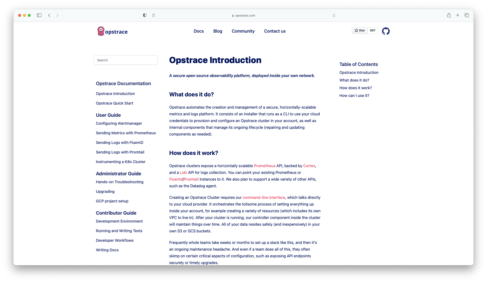

<p align="center">
  
</p>

<p align="center">
  <a href="https://github.com/opstrace/next-product-docs/actions/workflows/publish.yml"></a>
  <a href="https://github.com/opstrace/next-product-docs/actions/workflows/test.yml"></a>
  <a href="https://semantic-release.gitbook.io/semantic-release/"></a>
</p>

# Next.js Component for Product Docs

This component helps you to render your product documentation (`/docs`) on your
product website.
[Check out the Opstrace Docs for a full impression](https://opstrace.com/docs)
what this component does. Typically the website and product (docs) are in
separate repositories. This library offers three key functions:

1. `staticPaths` returns all available paths for static site generation in
   next.js
2. `pageProps` returns the required content such as sidebar routes, Table of
   Contents and Markdown
3. `Documentation` is a JSX function that contains the render function

You can read more about the whys and hows of this component in the
[Opstrace Blog](http://opstrace.com/blog/product-documentation-with-nextjs)

## Prerequisites

The main purpose of this component is to fetch and render Markdown from a
different repo. In this folder you need to create a `manifest.json` file which
contains the link structure for the documentation you want to show. This allows
you to control the sidebar levels and titles for links.

Sample:

```
/docs
/docs/README.md
...
```

Manifest:

```json
{
  "routes": [
    {
      "heading": true,
      "title": "Next Docs Documentation",
      "routes": [
        {
          "title": "Introduction",
          "path": "/docs/README.md"
        }
      ]
    }
  ]
}
```

You can find
[complete example here](https://github.com/zentered/next-product-docs-example/blob/main/docs/manifest.json)
or check out the
[Opstrace Documentation Manifest](https://github.com/opstrace/opstrace/blob/main/docs/manifest.json).

## Installation & Usage

In your Next.js website repo, run:

    yarn add @opstrace/next-product-docs

or

    npm install @opstrace/next-product-docs

The location of your product docs can be configured through environment
variables in your `.env` file. There are two possible ways to retrieve docs:

### Retrieve docs from GitHub Repo

ie. `github.com/zentered/next-product-docs-example/main`

```
GITHUB_TOKEN=
DOCS_FOLDER=docs
DOCS_ORG=zentered
DOCS_REPO=next-product-docs-example
DOCS_BRANCH=main
DOCS_FALLBACK=README
ASSETS_DESTINATION=/assets
```

### Retrieve docs from local docs folder

ie. `./content/docs`:

```
DOCS_PATH=content
DOCS_FOLDER=docs
DOCS_FALLBACK=README
ASSETS_DESTINATION=
```

Create a new page `pages/docs/[[...slug]].jsx` which calls the provided
`staticPaths` and `pageProps` functions:

```
import Head from 'next/head'
import {
  pageProps,
  staticPaths
} from 'next-product-docs/serialize'
import Documentation from 'next-product-docs'

export default function Docs({ title, source }) {
  return (
    <main>
      <Documentation source={source} />
    </main>
  )
}

export async function getStaticPaths() {
  const paths = await staticPaths()
  return { paths, fallback: false }
}

export async function getStaticProps(ctx) {
  return {
    props: {
      ...(await pageProps(ctx))
    }
  }
}
```

# Run Locally

```bash
    npm run watch
    # or yarn watch
```

Read how to link component in
[next-product-docs-example](https://github.com/zentered/next-product-docs-example)

## Additional Components

For convenience we're providing two additional components that help you get
started with a sidebar and table of contents. They contain styling classes, so
you should customize them as you

- [Sidebar](https://github.com/zentered/next-product-docs-example/blob/main/components/Sidebar.jsx)
- [Table of Contents (TOC)](https://github.com/zentered/next-product-docs-example/blob/main/components/Toc.jsx)

You can modify the page `[[slug]].jsx` and pass on `sidebarRoutes` and
`tocHeadings`, which contain the (nested) routes for the sidebar and toc. We're
using `react-scroll` to highlight the current section of the page in the table
of contents. In the sidebar you can easily integrate search for example with
[Algolia React InstantSearch](https://www.algolia.com/doc/guides/building-search-ui/what-is-instantsearch/react/).

## Contributing

Considering contributing to next-product-docs? We'd love to work with you!

To start a local development environment, have a look at our
[example repo](https://github.com/zentered/next-product-docs-example/blob/main/package.json#L20)
on how to link/unlink the component in a Next.js project.

Please join us for
[discussions in our community](https://go.opstrace.com/community).

You can also ping us on Twitter [@opstrace](http://twitter.com/opstrace) or
[@zenteredco](http://twitter.com/zenteredco). The only workaround we have at the
moment is forking the repository, publish new package versions to GitHub and
install them in the Next.js project where we use the component.

Please adhere to the Opstrace
[code of conduct](https://github.com/opstrace/opstrace/blob/main/CODE_OF_CONDUCT.md).

## Acknowledgements & Thanks

- [Next.js](https://nextjs.org) which showed us the approach of fetching and
  rendering docs from a remote repo (https://nextjs.org/docs and
  https://github.com/vercel/next.js/tree/canary/docs)
- [next-mdx-remote](https://github.com/hashicorp/next-mdx-remote) which allows
  us to load mdx/md content from anywhere
